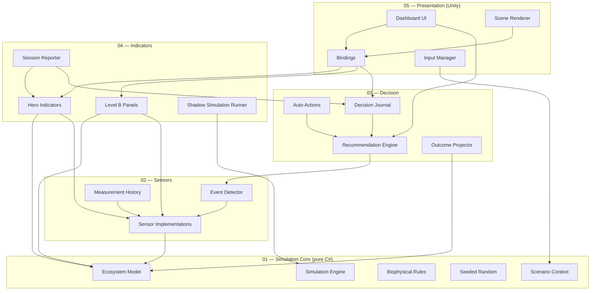

# ARCHITECTURE.md — Architecture technique

Document technique d'architecture du Bocage Digital Twin. À lire en
complément de `CLAUDE.md` (règles opérationnelles) et `DECISIONS.md`
(rationale des choix).

---

## 1. Schéma général en 5 couches



**Lecture** : une flèche `A --> B` signifie « A référence / dépend de B ».
Les flèches descendent toujours vers une couche d'indice strictement
inférieur. Aucune flèche ne remonte.

---

## 2. Description par couche

### Couche 01 — SimulationCore

**Responsabilité**

Modélisation biophysique pure du bocage. Tient l'état complet de
l'écosystème simulé et applique les règles de dynamique à chaque tick.

**Composants principaux**

- `SimulationEngine` : orchestrateur de tick, gère le temps simulé et la
  séquence d'application des règles.
- `EcosystemModel` : conteneur d'état (haies, prairie, bosquet, mare,
  arbres têtards, faune agrégée, météo, nappe, sol, etc.).
- `BiophysicalRules` : règles de dynamique (croissance, dégradation,
  hydrologie, propagation pathogènes, etc.). Implémente `IRule`.
- `SeededRandom` : générateur d'aléa déterministe avec sous-seeds dérivés
  par hash.
- `ScenarioContext` : paramètres scénario en cours (climat, pression
  agricole, contraintes réglementaires, horizon).
- `TransitioningParameter<T>` : interpolation des paramètres de scénario
  sur 7-14 jours simulés.

**Non-responsabilités**

- Aucun accès Unity (`UnityEngine`, `UnityEditor` interdits).
- Aucun I/O fichier ou réseau.
- Aucun rendu, aucun affichage.
- Aucune dépendance vers les couches supérieures.

**Dépendances** : aucune, hormis BCL .NET Standard 2.1.

---

### Couche 02 — Sensors

**Responsabilité**

Transforme l'état du modèle en mesures bruitées (modèle de capteur
réaliste) et détecte les événements significatifs.

**Composants principaux**

- `ISensor` : interface commune.
- Implémentations dans `Implementations/` (station météo, piézomètre,
  capteur acoustique, piège photo, tour eddy covariance).
- `EventDetector` : analyse les mesures pour détecter chalara,
  sécheresse prolongée, anomalies acoustiques, etc.
- `MeasurementHistory` : buffer circulaire des dernières mesures par
  capteur (taille bornée).

**Non-responsabilités**

- Ne modifie jamais l'état du modèle.
- Ne prend aucune décision.
- Ne touche pas à l'UI.

**Dépendances** : Couche 01 uniquement.

---

### Couche 03 — Decision

**Responsabilité**

Génère des recommandations à partir des événements détectés, projette
des issues probables sous incertitude, journalise les décisions.

**Composants principaux**

- `RecommendationEngine` : produit des recommandations à partir des
  événements détectés et du contexte.
- `OutcomeProjector` : projette des distributions d'issues à plusieurs
  horizons (court / moyen / long terme), avec incertitudes.
- `AutoActions` : actions automatiques (irrigation auxiliaire, etc.)
  appliquées si la simulation fonctionne avec `applyTechActions = true`.
- `DecisionJournal` : journal append-only des décisions (utilisateur ou
  algorithmiques) avec horodatage simulé.

**Non-responsabilités**

- Ne lit pas l'UI directement (l'UI consomme les recommandations via
  observable).
- Ne mute jamais directement l'`EcosystemModel` ; les actions
  s'appliquent via une interface dédiée (`IModelAction`).

**Dépendances** : Couches 01 et 02.

---

### Couche 04 — Indicators

**Responsabilité**

Agrège l'état du modèle et les mesures en KPIs et panneaux. Pilote la
simulation fantôme. Produit le rapport de session.

**Composants principaux**

- `HeroIndicators` : 5 KPIs principaux (densité haies, biodiversité
  composite, nappe phréatique, rentabilité intégrée, delta tech).
- `LevelBPanels` : 3 panneaux (Biodiversité, Climat & ressources,
  Économie) agrégeant les sous-indicateurs.
- `ShadowSimulationRunner` : exécute une seconde instance de
  `SimulationEngine` avec mêmes seeds et inputs mais
  `applyTechActions = false`. Produit les valeurs nécessaires au calcul
  du delta.
- `SessionReporter` : génère un rapport de fin de session (résumé KPIs
  finaux, décisions journalisées, divergence shadow).

**Non-responsabilités**

- Ne mute jamais le modèle.
- Ne décide pas (consomme les sorties de la Couche 03).

**Dépendances** : Couches 01, 02 et 03.

---

### Couche 05 — Presentation

**Responsabilité**

MonoBehaviours Unity. Rendu de la scène, UI, bindings vers les
ScriptableObjects observables, gestion des inputs utilisateur.

**Composants principaux**

- `DashboardUI` : Hero KPIs, panneaux Niveau B, popovers Niveau C,
  scenario panel, decision panel, comparison view, minimap.
- `SceneRenderer` : organisation des sprites de scène (background,
  midground, foreground, fauna, sensors), shaders pilotés par
  observables.
- `Bindings` : MonoBehaviours qui écoutent les ScriptableObjects
  observables (`OnChanged`) et mettent à jour les éléments visuels et UI.
- `InputManager` : capture les inputs utilisateur (sliders, clics
  recommandation, vitesses temps) et les répercute dans le
  `ScenarioContext` ou le `RecommendationEngine`.

**Non-responsabilités**

- Ne contient aucune logique biophysique.
- Ne calcule aucun KPI directement.
- Ne mute pas l'état du modèle de simulation.

**Dépendances** : toutes les couches inférieures.

---

## 3. Flux principal de données

À chaque tick :

1. **Inputs utilisateur** captés par `InputManager` → mis à jour dans le
   `ScenarioContext` (avec interpolation via `TransitioningParameter<T>`).
2. **Tick de simulation** : `SimulationEngine.Tick()` applique les règles
   biophysiques sur l'`EcosystemModel`, en utilisant `SeededRandom` et
   le `ScenarioContext`.
3. **Lecture capteurs** : chaque `ISensor` lit l'état du modèle et
   produit une mesure bruitée. `EventDetector` examine les mesures et
   peut publier des événements sur l'`EventBus`.
4. **Décision** : `RecommendationEngine` consomme les événements détectés
   et produit / met à jour les recommandations. `AutoActions` applique
   les contre-mesures automatiques si `applyTechActions = true`.
5. **Indicateurs** : `HeroIndicators` et `LevelBPanels` recalculent les
   KPIs à partir de l'état + mesures. `ShadowSimulationRunner` fait
   tourner sa propre instance et expose les mêmes KPIs en parallèle. Le
   delta est calculé.
6. **Bindings** : les composants `Bindings` écrivent les valeurs dans
   les ScriptableObjects observables, qui notifient leurs abonnés via
   `OnChanged`.
7. **UI et Scene** : les abonnés (UI widgets, shaders pilotés) lisent
   les nouvelles valeurs et se rafraîchissent.

Ce flux est descendant à l'aller (input → modèle → indicateurs) et
remontant au retour (observables → UI). À aucun moment une couche
inférieure ne lit une couche supérieure.

---

## 4. Cycle de vie d'une session utilisateur

1. **Bootstrap** : chargement de la scène `Main`. `_Bootstrap` initialise
   le `SimulationEngine` (real run + shadow run avec mêmes seeds), les
   `ScenarioContext`, les ScriptableObjects observables, les bindings.
2. **État initial affiché** : KPIs initiaux, scène statique avec sprites
   en place, recommandations vides, journal vide.
3. **Lecture utilisateur** : l'utilisateur observe l'état initial,
   éventuellement règle un preset via le scenario panel.
4. **Lancement de la simulation** : utilisateur appuie play. Tick rate
   x1 par défaut.
5. **Boucle de simulation** : tick après tick, les KPIs évoluent, des
   événements peuvent être détectés et apparaissent dans le decision
   panel sous forme de recommandations.
6. **Arbitrage utilisateur** : l'utilisateur accepte ou rejette les
   recommandations. Les choix sont journalisés.
7. **Modification de scénario en cours** : changement de preset →
   transition interpolée 7-14 jours simulés.
8. **Skip to end** : l'utilisateur peut sauter à l'horizon configuré.
9. **Rapport de fin de session** : `SessionReporter` produit le rapport
   final (KPIs, divergence shadow, journal des décisions).
10. **Persistance** : `PlayerPrefs` sauvegarde uniquement la dernière
    configuration de presets et la vitesse choisie.

---

## 5. Modèle d'horloges

Trois horloges distinctes :

- **Temps réel** (`Time.unscaledDeltaTime` Unity) : utilisé uniquement
  pour les animations cosmétiques de la Couche 5 (interpolations
  visuelles, transitions UI).
- **Temps simulé** : avance d'un tick = un jour simulé. Cadencé par le
  `SimulationEngine` via une coroutine indépendante de `Time.timeScale`.
- **Vitesse utilisateur** : x1 (1 tick / seconde temps réel), x10 (10
  ticks / seconde), skip to end (boucle exécutée au plus vite jusqu'à
  l'horizon).

Comportement sur **pause** : le temps simulé est gelé, les animations
Couche 5 continuent à s'exécuter (les sprites de faune en pool restent
animés visuellement). C'est un choix délibéré pour éviter une scène
figée disgracieuse.

Le **skip to end** désactive temporairement les bindings vers la Couche
5 (pas de rafraîchissement intermédiaire de l'UI), exécute les ticks au
plus vite, puis pousse une mise à jour finale.

---

## 6. Gestion de la simulation fantôme

Interface centrale :

```csharp
public interface ISimulationRun
{
    EcosystemModel Model { get; }
    bool ApplyTechActions { get; }
    void Tick();
}
```

Deux instances sont créées au bootstrap :

- **Real run** : `applyTechActions = true`. Les recommandations
  acceptées et les `AutoActions` mutent le modèle.
- **Shadow run** : `applyTechActions = false`. Aucune action tech n'est
  appliquée. Reçoit les mêmes inputs scénario.

**Garanties** :

- Mêmes `SeededRandom` (seed maître identique, dérivation par hash
  identique pour les sous-systèmes).
- Mêmes `ScenarioContext` (les inputs utilisateur de scénario
  s'appliquent à both).
- Toute divergence d'état entre real et shadow est attribuable
  exclusivement à l'application (ou non) des actions tech.

Le `delta tech` Hero KPI = (KPI integrated profitability real) − (KPI
integrated profitability shadow), exprimé en pourcentage relatif à
shadow.

---

## 7. Conventions de nommage et d'organisation

### Classes

- `PascalCase` pour les noms de classes, types et méthodes publiques.
- `_camelCase` pour les champs privés.
- Suffixes explicites :
  - `*ScriptableObject` n'est pas nécessaire (le type est implicite par
    le namespace `Data.RuntimeContainers`).
  - `*Event` pour les classes d'événements de l'`EventBus`.
  - `*Binding` pour les MonoBehaviours de la Couche 5 qui écoutent un
    observable.
  - `*Rule` pour les règles biophysiques de la Couche 1.
  - `*Sensor` pour les implémentations de capteurs.

### ScriptableObjects observables

- Nom de fichier asset : `RC_<Domain>.asset` (ex.
  `RC_HedgerowDensity.asset`, `RC_Biodiversity.asset`).
- Stockés dans `Assets/_Project/Data/RuntimeContainers/`.
- Pattern : champ privé sérialisé + getter public + méthode `Set(value)`
  qui invoque `OnChanged`.

### Événements EventBus

- Classes immutables, suffixe `Event` (ex. `ChalaraDetectedEvent`,
  `DroughtThresholdCrossedEvent`).
- Stockés dans `Assets/_Project/Events/`.

### Asmdef

- Un asmdef par couche, nommé `Bocage.<Layer>` (ex.
  `Bocage.SimulationCore`, `Bocage.Sensors`, etc.).
- Références strictes définies dans le fichier asmdef.

### Scènes et hiérarchie

- Scène unique : `Main.unity` dans `Assets/_Project/`.
- 7 racines préfixées `_` (cf `CLAUDE.md` §8).

### Logging

- Pas de `Debug.Log` direct. Utiliser `SimLogger.DebugLog`,
  `SimLogger.SimulationLog`, `SimLogger.UserActionLog`.
- Format : `[<Layer>] <message> {context: ...}`.

### Tests

- Stockés dans `Assets/_Project/Tests/EditMode/`.
- Asmdef de tests référence uniquement la Couche 1 (les tests EditMode
  ne touchent pas Unity runtime).
- Nommage : `<ClassUnderTest>Tests.cs`.
