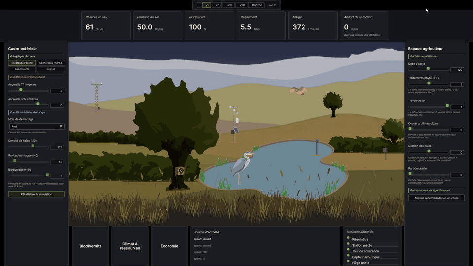

# Bocage Digital Twin

*A digital twin of a Norman bocage — built to test, honestly, whether data can reconcile ecology and economy.*

**▶ [Open the live demo](https://paul-des-brosses.github.io/bocage-digital-twin/)** — runs in the browser (WebGL, desktop ≥ 1280 px).

<!--
  HERO MEDIA — insert a 10-15s GIF (or MP4) of the running demo showing the
  scene + dashboard + one preset change. Drop the file under docs/media/ and
  reference it here, e.g.:
  
-->

---

## Why I built it

I wanted an ambitious Unity project to sharpen my skills — so I picked something I actually care about: **the landscapes of my Normandy**, and a conviction worth testing. Ecology and economy get endlessly cast as opposites; I think **access to data is what lets you reconcile them** rather than forever trading one against the other — the promise of Industry 4.0, a field that genuinely excites me, brought down to a single field of crops.

So instead of just *asserting* it, I built a model that **tests** it — honestly. The simulation never assumes the answer: manage badly and ecology *and* economy both suffer, and the twin says so. And I made it a real **digital twin, not a video game** — every pixel traces back to a measured variable, never to the calendar or a scripted mood.

## What it is

A real-time simulation of a fictional but plausible **instrumented bocage site in the Perche**. You step into the farmer's shoes: pull the management levers — nitrogen, pesticides, tillage, cover crops, hedgerows, grassland share — against climate and market pressure, and watch the consequences cascade through water, soil carbon, nitrogen, yield, biodiversity and profitability.

## An honest note on what the sensors are *for*

One of the five headline indicators measures the **contribution of instrumentation** — the gap between steering the land on the model's measured data versus leaving the starting decisions untouched. Read it for what it is:

> **the marginal gain of *precision*, not proof that good farming needs sensors.**

You can manage a bocage responsibly with an agronomist's eye and no instrumentation at all. What the data buys is *millimetre optimisation* of each decision lever — the **Industry-4.0 layer on top of already-sound practice**. This twin is a lens on that marginal gain, not a sales pitch for buying sensors. Keeping that honest is the point.

## What you can do

- **Run the farm.** 6 management levers + 2 climate dials + a starting month, applied live. Four ready-made strategies (*Reference*, *Low-input*, *Intensive*, *RCP4.5 drought*) to start from.
- **Read the land.** 5 Hero KPIs (water reserve % RU, soil carbon, biodiversity index, crop yield, margin €/ha·yr) plus the instrumentation contribution above, and 3 thematic panels — *Biodiversity*, *Climate & resources*, *Economy* — each number traceable to a model variable.
- **Inspect the sensors.** 5 instruments (weather station, eddy-covariance tower, piezometer, acoustic + camera-trap fauna) listed in a side panel and clickable in the scene for their live measured reading and noise model.
- **Arbitrate the advice.** A model-derived recommendation engine surfaces win-win moves as proactive pop-ups and trade-offs as a passive list — you decide.
- **See it breathe.** Birds cross the scene and a heron settles in only when the *measured* biodiversity index earns them. No calendar, no scripted ambience — *sensor primacy*: every visual traces back to a measurement.

→ **New here? [How to drive the demo in 2 minutes](docs/GUIDE.md).**
→ **Curious about the science? [Plain-language model overview](docs/SIMULATION_OVERVIEW.md)** (then the sourced technical specs it links to).

## How it works, in one paragraph

Two simulations tick in lockstep on the same seeds: the **real run** follows your decisions; a **frozen-baseline shadow run** keeps the starting decisions untouched. The difference between them, in euros, *is* the instrumentation contribution — measured, not assumed. One tick is one simulated day; run at ×1, ×10, or skip to the end. Levers apply immediately. The whole thing is deterministic: same seed and inputs → same run. *(The full causal model — water bucket → yield → residues → carbon → water capacity, and the nitrogen / biodiversity / economy couplings — is laid out in the [model overview](docs/SIMULATION_OVERVIEW.md).)*

## Tech stack

- **Engine**: Unity 6 LTS, URP 2D Renderer · **Language**: C# · **Rendering**: flat-colour 2D with custom Shader Graph shaders (sky, prairie, hedgerows, pond).
- **Architecture**: strict 5-layer separation (Simulation Core / Sensors / Decision / Indicators / Presentation), enforced by Assembly Definitions — the simulation core is pure C# with zero `UnityEngine` dependency and is unit-tested headless.
- **Data flow**: observable ScriptableObject containers (single-writer, many-readers) + a static EventBus for punctual events.
- **Build & deploy**: WebGL (Brotli, IL2CPP, high stripping) → GitHub Pages via GitHub Actions (Buildalon Unity build).
- **Testing**: Unity Test Framework (EditMode) on the simulation core, plus a headless `dotnet test` harness for fast iteration.

## Getting started

- **Unity**: `6000.4.4f1` (Unity 6 LTS). Open the project from Unity Hub.
- **Scene**: `Assets/_Project/Main.unity` (the only scene — cf. [DECISIONS.md](docs/DECISIONS.md) #25). Press Play.
- **Tests**: `Window > General > Test Runner > EditMode > Run All` — green on a fresh clone.

## Scientific basis

Orders of magnitude are anchored on public sources — not validated for operational use, but defensible and recognisable to a Perche agronomist:

- **[INRAE](https://www.inrae.fr)** · **[Solagro](https://solagro.org)** — bocage carbon, agroecological parameters
- **Arvalis / COMIFER / [Agreste](https://agreste.agriculture.gouv.fr)** — yield, nitrogen response, regional crop statistics
- **[Efese](https://www.ecologie.gouv.fr/evaluation-francaise-des-ecosystemes-et-des-services-ecosystemiques-efese)** — ecosystem-services monetisation · **MAEC** — agri-environmental policy
- **[PNR du Perche](https://www.parc-naturel-perche.fr)** — site context, species, hedgerow densities · **Météo-France** (Tourouvre-au-Perche normals) — weather generator

Every constant and its source is documented in the [model spec](docs/refonte/08_MODELE.md).

## Going further

- [**Plain-language model overview**](docs/SIMULATION_OVERVIEW.md) — what is simulated and why (the recommended next read).
- [**Software architecture**](docs/ARCHITECTURE.md) — the 5 layers, asmdef graph, data flow.
- [**Model & engine specs**](docs/refonte/) — biophysical model, KPI/decision engine, and the mathematical verification, with every number sourced.
- [**Design decisions**](docs/DECISIONS.md) — the rationale log (ADRs).

---

*A student R&D portfolio project (M1 ESILV, Creative Technology). Built to be read at whatever depth you want — skim the demo, or follow the links down to the sourced equations.*
