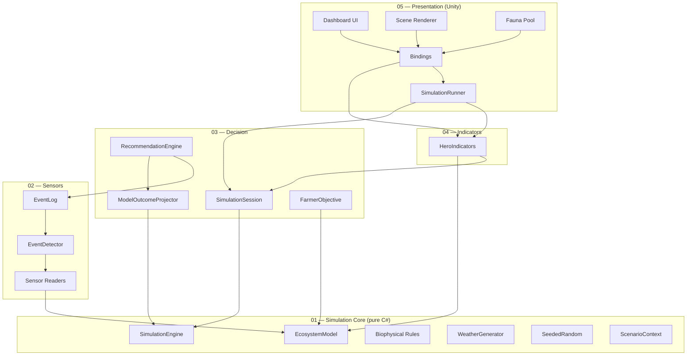

# ARCHITECTURE.md — Technical architecture

Technical architecture document for the Bocage Digital Twin. To be read
alongside `CLAUDE.md` (operational rules), `DECISIONS.md` (rationale for
the choices), and `refonte/08_MODELE.md` (the detailed biophysical
model). For a plain-language view, see `SIMULATION_OVERVIEW.md`.

> **Updated 2026-06-11**: aligned with the **refonte** model (S5 cutover).
> The parallel `*.Refonte` namespaces have been removed; the code lives at
> the layer roots (`Bocage.SimulationCore`, `Bocage.Sensors`, …).

---

## 1. Overall 5-layer diagram

**How to read it**: an arrow `A --> B` means "A references / depends on B".
Arrows always point down to a layer of strictly lower index. No arrow ever
points up — the invariant is **enforced by the asmdefs** (Layer 01 has
`noEngineReferences: true` and sees no upper layer).

---

## 2. Layer-by-layer description

### Layer 01 — SimulationCore

**Responsibility** — Pure biophysical modelling of the bocage. Holds the
complete ecosystem state and applies the dynamics rules at every tick
(1 tick = 1 day). Pure C#: no `UnityEngine`, no I/O, no system clock.

**Main components**

- `EcosystemModel`: state container (soil water reserve `θ`, water table,
  two-pool young/old carbon, mineral nitrogen, yield, hedgerow density,
  biodiversity, weed pressure, capital). Invariants (positivity, [0,1]
  bounds) guaranteed at the setters.
- `ScenarioContext`: scenario parameters — climate (T° anomaly, rain
  factor), 6 management levers, starting month. **Immediate application**
  (the old `TransitioningParameter` interpolation was removed at the
  cutover, MVP S2 decision).
- `SimulationEngine`: tick orchestrator. Causal order of a day:
  `weather → heat windows → water θ → water table → weeds → yield →
  nitrogen → carbon → flora → biodiversity → economy → day+1`. Circular
  loops (carbon↔nitrogen↔yield) are resolved with a one-day lag on the
  slow variables.
- **Rules** (`*Rule`): `WaterBalanceRule` (FAO-56 bucket + Hargreaves ETP),
  `NappeRule`, `WeedPressureRule`, `YieldRule` (potential × water/nitrogen/
  heat/weed stress, saturating Mitscherlich nitrogen response), `NitrogenDynamicsRule`
  (explicit nitrogen budget), `CarbonDynamicsRule` (two-pool ICBM,
  Q10 climate-sensitive decomposition), `HedgeFloraRule`, `BiodiversityRule` (4 factors),
  `EconomyRule` (margin + service payments).
- `WeatherGenerator` / `Climatology`: stochastic weather (Markov-chain
  occurrence + AR(1) temperature + log-normal intensity) calibrated on the
  Tourouvre-au-Perche normals.
- `SeededRandom`: deterministic randomness with hash-derived sub-streams
  (weather, sensors, fauna independent).
- `Logging/SimLogger`: 3-level logging facade (Debug / Simulation /
  UserAction), wired to the Unity console at bootstrap (Layer 05).

**Dependencies**: none besides the .NET BCL. `noEngineReferences: true`.

---

### Layer 02 — Sensors

**Responsibility** — Turns the model state into **noisy measurements**
(sensor model) and detects significant events.

**Main components**

- **Readers** (stateless, simple Gaussian-noise adders):
  `WeatherStationReader` (T° + rain + soil moisture), `PiezometerReader`
  (water-table depth), `EddyTowerReader` (net CO₂ flux + *estimated*
  integrated carbon stock), `FaunaSensorReader` (fauna index, fused
  acoustic + camera channels). Each uses a dedicated `SeededRandom`
  sub-stream.
- `EventDetector`: compares the **measurements** (not the model's ground
  truth — *sensor primacy*, CLAUDE.md §9) against calibrated thresholds and
  emits events: `HydricStress` (piezometer depth), `SoilCarbonLow`
  (Eddy-tower estimated stock), `FaunaAnomaly` (measured index), `LowProfitability`.
  Per-type cooldown against spam.
- `EventLog` + `EventKind` (enum) + `DetectedEvent` (struct): append-only
  event journal; each entry carries the **measured** value that crossed the
  threshold.

**Non-responsibilities** — Never mutates the model; makes no decisions;
never touches the UI.

**Dependencies**: Layer 01 only.

---

### Layer 03 — Decision

**Responsibility** — Orchestrates the real run + the shadow run, generates
**model-derived** recommendations, projects their outcomes, and owns the
decision lifecycle.

**Main components**

- `SimulationSession`: **the orchestrating brain.** Owns the
  `RealModel` and the `ShadowModel` and ticks them **in lockstep** (same
  weather seed). The shadow is a **frozen baseline** (`CreateFrozenShadowFrom`:
  shared climate/policies, farmer decisions frozen at launch).
  Exposes the measurements (moisture, fauna, water table), the estimated
  carbon, the fluxes, the weather aggregates, and the **net tech value**
  (`TechValueNetEurosPerHa` = real capital − shadow capital − investments).
  Also owns the recommendation lifecycle (pending, accept, dismiss, defer,
  anti-spam cooldown).
- `RecommendationEngine`: for a given event, builds the feasible levers,
  **projects each one forward** (the real engine, on a copy of the state)
  and keeps the one that best serves the objective. No hard-coded
  coefficients.
- `ModelOutcomeProjector`: projects an `OutcomeDistribution` (worst /
  expected / best) at 2 horizons (30 d, 365 d), the spread coming from
  several weather realisations.
- `FarmerObjective`: objective function (dominant margin − risk penalty)
  that ranks the lever levels.
- `DecisionLever` (enum, 6 levers: NitrogenDose, Pesticide, Tillage,
  CoverCrops, HedgeManagement, Grassland), `Recommendation` (struct),
  `RecommendationSurfacing`: classifies the recommendation as *win-win*
  (proactive popup) vs *trade-off* (passive list), with a biodiversity
  guardrail on economic counter-recommendations.

**Key invariant** — **Recommendations ⊆ levers**: anything a recommendation
proposes is also directly actionable at the slider. There is no longer a
`DecisionJournal`, `AutoActionPipeline` or `IRecommendation` (refonte):
accepted decisions are applied by the session via `ApplyDecision`.

**Dependencies**: Layers 01 and 02.

---

### Layer 04 — Indicators

**Responsibility** — Aggregates the model state and the session into KPIs.

**Main component** — `HeroIndicators`: pure functions computing +
normalising the Hero KPIs (margin, yield, biodiversity, soil carbon,
water reserve %RU) and the tech value, plus the Level-B panel values.
There is no longer one class per KPI (the old `Hero/` folder was
removed) nor a separate shadow/horizon indicator: the tech value comes
from `SimulationSession`.

**Non-responsibilities** — Never mutates the model; makes no decisions.

**Dependencies**: Layers 01, 02 and 03.

---

### Layer 05 — Presentation

**Responsibility** — Unity MonoBehaviours. Scene rendering, UI Toolkit,
bindings to the observable ScriptableObjects, user inputs.

**Main components**

- `SimulationRunner` (`[DefaultExecutionOrder(-8000)]`): owns a
  `SimulationSession` and paces it via a coroutine
  (`WaitForSecondsRealtime`, independent of `Time.timeScale`). Every
  tick: advances the session (real + shadow), fires the subscribers
  (`TickCompleted`), then **publishes the indicators** into the `RC_*`
  containers. Sole writer; bindings only read. Starts **paused**
  (`autoStart` off); a `static bool IsTicking` is read by the fauna.
- **Scenario bindings**: `ScenarioControlsBinding` (6 levers + 2 climate
  → `Session.ApplyDecision` / `SetClimate`), `ScenarioPresetsBinding` (4
  complete strategies), `MonthSelectorBinding`, `SpeedControlsBinding`
  (pause / ×1 / ×10 / skip).
- **Display bindings**: the Hero labels, the Level-B tabs
  (`OngletClimat/Economie/BiodivBinding`), the `SensorInspectorPanelBinding`
  (lightweight inspector on sensor click), `DecisionPopupBinding` +
  `DecisionPanelBinding` (recommendations), `ConsoleBinding`.
- **Visible fauna**: `FaunaPool` (pooling), `FaunaPoolBinding` (Poisson
  spawn derived from the measured biodiversity), `FaunaTraversalMotion`,
  `FaunaStaticAppearance` (heron sentinel).
- **Scene & shaders**: `SceneAssembler`, `SensorVisualPlacer`, the shader
  bindings (`MeadowShaderBinding`, `PondShaderBinding`,
  `HedgerowShaderBinding`).

There is no longer a `ShadowSimulationRunner`, `AutoActionApplier`,
`ManualActionsBinding` or `SimulationTraceRecorder` (removed at the
cutover): the shadow lives in `SimulationSession` (Layer 03), not in
Layer 05.

**Dependencies**: all lower layers + `Data.RuntimeContainers`.

---

## 3. Main data flow

At every tick:

1. **User inputs** captured by the scenario bindings (Layer 05) →
   `Session.ApplyDecision` / `SetClimate` → `ScenarioContext` (immediate
   application).
2. **Session tick** (`SimulationSession.Tick`): advances the real
   `SimulationEngine` (biophysical rules on the `RealModel` in the causal
   order of §2), reads the sensors (Layer 02), runs event detection and the
   recommendation update, **then advances the shadow run** by one tick in
   lockstep.
3. **Indicators**: `HeroIndicators` (Layer 04) recomputes the KPIs from
   the state + the session (including the real − shadow tech value).
4. **Publication**: `SimulationRunner.PublishIndicators` writes the values
   into the observable `RC_*` ScriptableObjects, which notify via `OnChanged`.
5. **UI & Scene**: the subscribed bindings (labels, tabs, shaders, fauna)
   read the new values and refresh.

Downward on the way in (input → model → indicators), upward on the way
back (observables → UI). No lower layer ever reads an upper layer.

---

## 4. Lifecycle of a user session

1. **Bootstrap**: `Main` loads. The `SimulationRunner` builds its
   `SimulationSession` (real + frozen shadow, same master seed). RCs and
   bindings initialised. **Starts paused.**
2. **Initial state displayed**: initial KPIs, scene in place, empty
   recommendations.
3. **Launch**: the user presses *Lancer* (start). Tick rate ×1 by default.
4. **Loop**: tick after tick, the KPIs evolve; events may be detected and
   surfaced as recommendations.
5. **Arbitration**: the user accepts / dismisses / defers the
   recommendations.
6. **Mid-run scenario changes**: levers and climate applied
   **immediately**; the starting month only takes effect on reset.
7. **Skip to end**: jump to the configured horizon (ends paused).
8. **Persistence**: `PlayerPrefs` — only the last preset + speed.

A synthetic session reporter remains a *backlog* item (cf
`CLAUDE.md` §5.4), not implemented.

---

## 5. Clock model

- **Real time** (`Time.unscaledDeltaTime`): cosmetic Layer-5 animations
  only (fauna, UI transitions).
- **Simulated time**: 1 tick = 1 day, paced by the `SimulationRunner` via
  a coroutine independent of `Time.timeScale`.
- **Speeds**: ×1 (1 tick/s), ×10 (10 ticks/s), skip-to-end (loops as fast
  as possible up to the horizon).

On **pause**: simulated time freezes, but the Layer-5 animations keep
running (the pooled fauna stays animated) — a deliberate choice to avoid a
frozen scene.

---

## 6. The shadow simulation (contribution of the tech)

No `ISimulationRun` interface, no `applyTechActions` flag. The
`SimulationSession` (Layer 03) owns **two `EcosystemModel`s** built on the
**same master seed**:

- **Real run**: follows the user's decisions.
- **Shadow run**: a "passive farmer" baseline, derived through
  `ScenarioContext.CreateFrozenShadowFrom`. The **exogenous** parameters
  (climate, MAEC, PES) are shared; the **decision** parameters (levers) are
  **frozen** at their launch value.

Both runs advance in **lockstep** inside `Tick()`, sharing the generated
weather (same seed) — all rule randomness is reproduced identically.
As long as no decision diverges, the shadow equals the real run and the
tech value reads **0 by construction** ("the tech isn't changing anything
yet").

**Net tech value** = `real capital − shadow capital − investments`
(sensor costs excluded). Positive if the informed strategy earns more than
it costs.

---

## 7. Naming and organisation conventions

- `PascalCase` (types, public methods), `_camelCase` (private fields).
- Suffixes: `*Rule` (biophysical rules, Layer 01), `*Reader` (sensors,
  Layer 02), `*Binding` (MonoBehaviours listening to an observable, Layer
  05), `*EventBus` (punctual UI signals, e.g. `SensorClickedEventBus`).
- **Model events**: `EventKind` (enum) + `DetectedEvent` (struct),
  consumed through the append-only `EventLog` (no EventBus for state).
- **Observable ScriptableObjects**: `RC_<Domain>.asset` in
  `Assets/_Project/Data/RuntimeContainers/`. Pattern: serialised private
  field + public getter + `Set(value)` that raises `OnChanged`.
- **Asmdef**: one per layer, `Bocage.<Layer>`, strict references (Layer N
  only sees layers M < N; Layer 01 `noEngineReferences`).
- **Scene**: single (`Main.unity`), 7 roots prefixed with `_` (CLAUDE.md §8).
- **Logging**: no direct `Debug.Log`; go through `SimLogger`.
- **Tests**: `Assets/_Project/Tests/EditMode/`, named `<Class>Tests.cs`.

---

## 8. Calibration & verification

The details of the constants and their sources live in
[`refonte/08_MODELE.md`](refonte/08_MODELE.md) (§8, sourced table); the
mathematical verification (dimensional analysis, equilibria, stability,
interior optima) in [`refonte/11_VERIFICATION-MATHS.md`](refonte/11_VERIFICATION-MATHS.md).
The nitrogen-response calibration was redone on Arvalis/COMIFER/INRAE
(08 §5.5), locked in by `NitrogenResponseCalibrationTests`.

The history of the work packages (pre-refonte E1-E11, then refonte I1-I6
and S5 cutover) lives in [`ROADMAP.md`](ROADMAP.md); the old
[`CALIBRATION.md`](CALIBRATION.md) is kept as a pre-refonte archive.

---

## 9. Architecture impact recap

The refonte **did not break the architecture**: the 5 layers remain
strictly stacked, the asmdef boundaries respected, the Unity / pure-C#
boundary intact (Layers 01-04 without `UnityEngine`). The main structural
shift is the **internalisation of the shadow run** into
`SimulationSession` (Layer 03) — there is no longer a shadow runner or an
auto-action pipeline in Layer 05 — and the move from a recommendation
dispatch with hard-coded coefficients to a **model-derived selection**
(forward projection per lever).
