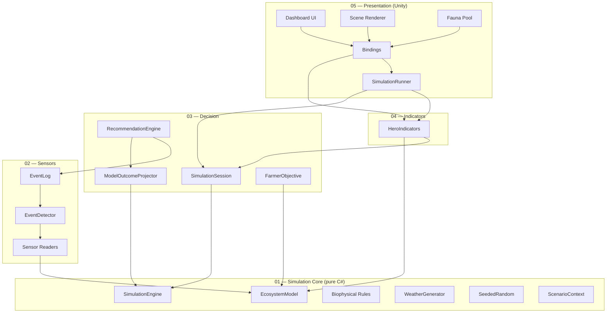

# ARCHITECTURE.md — Architecture technique

Document technique d'architecture du Bocage Digital Twin. À lire en
complément de `CLAUDE.md` (règles opérationnelles), `DECISIONS.md`
(rationale des choix), et `refonte/08_MODELE.md` (le modèle biophysique
détaillé). Pour une vue vulgarisée, voir `SIMULATION_OVERVIEW.md`.

> **Mis à jour 2026-06-11** : aligné sur le modèle **refonte** (cutover S5).
> Les namespaces `*.Refonte` parallèles ont été retirés ; le code vit aux
> racines de couche (`Bocage.SimulationCore`, `Bocage.Sensors`, …).

---

## 1. Schéma général en 5 couches

**Lecture** : une flèche `A --> B` signifie « A référence / dépend de B ».
Les flèches descendent toujours vers une couche d'indice strictement
inférieur. Aucune flèche ne remonte — l'invariant est **forcé par les
asmdef** (la Couche 01 a `noEngineReferences: true` et ne voit aucune
couche supérieure).

---

## 2. Description par couche

### Couche 01 — SimulationCore

**Responsabilité** — Modélisation biophysique pure du bocage. Tient l'état
complet de l'écosystème et applique les règles de dynamique à chaque tick
(1 tick = 1 jour). Pur C# : aucun `UnityEngine`, aucun I/O, aucun chrono.

**Composants principaux**

- `EcosystemModel` : conteneur d'état (réserve en eau du sol `θ`, nappe,
  carbone 2 pools jeune/vieux, azote minéral, rendement, densité de haie,
  biodiversité, pression d'adventices, capital). Invariants (positivité,
  bornes [0,1]) garantis aux setters.
- `ScenarioContext` : paramètres scénario — climat (anomalie T°, facteur
  pluie), 6 leviers de conduite, mois de départ. **Application immédiate**
  (l'ancienne interpolation `TransitioningParameter` a été retirée au
  cutover, décision MVP S2).
- `SimulationEngine` : orchestrateur de tick. Ordre causal d'un jour :
  `météo → fenêtres chaleur → eau θ → nappe → adventices → rendement →
  azote → carbone → flore → biodiversité → économie → jour+1`. Les boucles
  circulaires (carbone↔azote↔rendement) sont résolues par un décalage d'un
  jour sur les variables lentes.
- **Règles** (`*Rule`) : `WaterBalanceRule` (seau FAO-56 + ETP Hargreaves),
  `NappeRule`, `WeedPressureRule`, `YieldRule` (potentiel × stress eau/azote/
  chaleur/adventices, réponse azotée Mitscherlich saturante), `NitrogenDynamicsRule`
  (bilan azoté explicite), `CarbonDynamicsRule` (ICBM 2 pools, décomposition
  sensible au climat Q10), `HedgeFloraRule`, `BiodiversityRule` (4 facteurs),
  `EconomyRule` (marge + paiements de services).
- `WeatherGenerator` / `Climatology` : météo stochastique (chaîne de Markov
  occurrence + AR(1) température + log-normale intensité) calibrée sur les
  normales Tourouvre-au-Perche.
- `SeededRandom` : aléa déterministe à sous-flux dérivés par hash (météo,
  capteurs, faune indépendants).
- `Logging/SimLogger` : façade de log à 3 niveaux (Debug / Simulation /
  UserAction), branchée à la console Unity au bootstrap (Couche 05).

**Dépendances** : aucune, hormis la BCL .NET. `noEngineReferences: true`.

---

### Couche 02 — Sensors

**Responsabilité** — Transforme l'état du modèle en **mesures bruitées**
(modèle de capteur) et détecte les événements significatifs.

**Composants principaux**

- **Readers** (sans état, simples ajouteurs de bruit gaussien) :
  `WeatherStationReader` (T° + pluie + humidité du sol), `PiezometerReader`
  (profondeur de nappe), `EddyTowerReader` (flux net CO₂ + stock carbone
  *estimé* intégré), `FaunaSensorReader` (indice de faune, canaux acoustique
  + caméra fusionnés). Chacun utilise un sous-flux `SeededRandom` dédié.
- `EventDetector` : compare les **mesures** (pas la vérité du modèle —
  *primauté du capteur*, CLAUDE.md §9) à des seuils calibrés et émet des
  événements : `HydricStress` (profondeur piézomètre), `SoilCarbonLow`
  (stock estimé tour Eddy), `FaunaAnomaly` (indice mesuré), `LowProfitability`.
  Cooldown par type contre le spam.
- `EventLog` + `EventKind` (enum) + `DetectedEvent` (struct) : journal
  append-only des événements ; chaque entrée porte la valeur **mesurée** qui
  a franchi le seuil.

**Non-responsabilités** — Ne mute jamais le modèle ; ne décide pas ; ne
touche pas l'UI.

**Dépendances** : Couche 01 uniquement.

---

### Couche 03 — Decision

**Responsabilité** — Orchestre le run réel + le run fantôme, génère des
recommandations **dérivées du modèle**, projette leurs issues, et porte le
cycle de vie des décisions.

**Composants principaux**

- `SimulationSession` : **le cerveau orchestrateur.** Possède le
  `RealModel` et le `ShadowModel` et les ticke **en lockstep** (même graine
  météo). Le shadow est une **baseline gelée** (`CreateFrozenShadowFrom` :
  climat/politiques partagés, décisions agriculteur figées au lancement).
  Expose les mesures (humidité, faune, nappe), le carbone estimé, les flux,
  les agrégats météo, et la **valeur-techno nette** (`TechValueNetEurosPerHa`
  = capital réel − capital fantôme − investissements). Porte aussi le cycle
  de vie des recos (pending, accept, dismiss, defer, cooldown anti-spam).
- `RecommendationEngine` : pour un événement, construit les leviers
  faisables, **projette chacun en avant** (le vrai moteur, sur une copie de
  l'état) et garde celui qui sert le mieux l'objectif. Pas de coefficients
  figés.
- `ModelOutcomeProjector` : projette une `OutcomeDistribution` (worst /
  expected / best) à 2 horizons (30 j, 365 j), le spread venant de plusieurs
  réalisations météo.
- `FarmerObjective` : fonction-objectif (marge dominante − pénalité de
  risque) qui classe les niveaux de levier.
- `DecisionLever` (enum, 6 leviers : NitrogenDose, Pesticide, Tillage,
  CoverCrops, HedgeManagement, Grassland), `Recommendation` (struct),
  `RecommendationSurfacing` : classe la reco en *gagnant-gagnant* (popup
  proactif) vs *compromis* (liste passive), avec garde-fou biodiversité sur
  les contre-recommandations économiques.

**Invariant clé** — **Reco ⊆ leviers** : tout ce qu'une reco propose est
aussi actionnable directement au slider. Il n'y a plus de `DecisionJournal`,
d'`AutoActionPipeline` ni d'`IRecommendation` (refonte) : les décisions
acceptées sont appliquées par la session via `ApplyDecision`.

**Dépendances** : Couches 01 et 02.

---

### Couche 04 — Indicators

**Responsabilité** — Agrège l'état du modèle et la session en KPIs.

**Composant principal** — `HeroIndicators` : fonctions pures de calcul +
normalisation des Hero KPIs (marge, rendement, biodiversité, carbone sol,
réserve en eau %RU) et de la valeur-techno, plus les valeurs des panneaux
Niveau B. Il n'y a plus de classe par KPI (l'ancien dossier `Hero/` a été
supprimé) ni d'indicateur de shadow/horizon séparé : la valeur-techno vient
de `SimulationSession`.

**Non-responsabilités** — Ne mute jamais le modèle ; ne décide pas.

**Dépendances** : Couches 01, 02 et 03.

---

### Couche 05 — Presentation

**Responsabilité** — MonoBehaviours Unity. Rendu de la scène, UI Toolkit,
bindings vers les ScriptableObjects observables, inputs utilisateur.

**Composants principaux**

- `SimulationRunner` (`[DefaultExecutionOrder(-8000)]`) : possède une
  `SimulationSession` et la cadence via une coroutine
  (`WaitForSecondsRealtime`, indépendante de `Time.timeScale`). À chaque
  tick : avance la session (réel + fantôme), déclenche les souscripteurs
  (`TickCompleted`), puis **publie les indicateurs** dans les conteneurs
  `RC_*`. Unique écrivain ; les bindings ne font que lire. Démarre **en
  pause** (`autoStart` off) ; un `static bool IsTicking` est lu par la faune.
- **Bindings de scénario** : `ScenarioControlsBinding` (6 leviers + 2 climat
  → `Session.ApplyDecision` / `SetClimate`), `ScenarioPresetsBinding` (4
  stratégies complètes), `MonthSelectorBinding`, `SpeedControlsBinding`
  (pause / ×1 / ×10 / skip).
- **Bindings d'affichage** : les labels Hero, les onglets Niveau B
  (`OngletClimat/Economie/BiodivBinding`), le `SensorInspectorPanelBinding`
  (inspecteur léger au clic capteur), `DecisionPopupBinding` +
  `DecisionPanelBinding` (recos), `ConsoleBinding`.
- **Faune visible** : `FaunaPool` (pooling), `FaunaPoolBinding` (spawn
  Poisson dérivé de la biodiversité mesurée), `FaunaTraversalMotion`,
  `FaunaStaticAppearance` (sentinelle héron).
- **Scène & shaders** : `SceneAssembler`, `SensorVisualPlacer`, les
  bindings de shaders (`MeadowShaderBinding`, `PondShaderBinding`,
  `HedgerowShaderBinding`).

Il n'existe plus de `ShadowSimulationRunner`, `AutoActionApplier`,
`ManualActionsBinding` ni `SimulationTraceRecorder` (supprimés au cutover) :
le fantôme vit dans `SimulationSession` (Couche 03), pas en Couche 05.

**Dépendances** : toutes les couches inférieures + `Data.RuntimeContainers`.

---

## 3. Flux principal de données

À chaque tick :

1. **Inputs utilisateur** captés par les bindings de scénario (Couche 05) →
   `Session.ApplyDecision` / `SetClimate` → `ScenarioContext` (application
   immédiate).
2. **Tick de session** (`SimulationSession.Tick`) : avance le `SimulationEngine`
   réel (règles biophysiques sur le `RealModel` dans l'ordre causal §2), lit
   les capteurs (Couche 02), lance la détection d'événements et la mise à
   jour des recommandations, **puis avance le run fantôme** d'un tick en
   lockstep.
3. **Indicateurs** : `HeroIndicators` (Couche 04) recalcule les KPIs depuis
   l'état + la session (dont la valeur-techno réel − fantôme).
4. **Publication** : `SimulationRunner.PublishIndicators` écrit les valeurs
   dans les ScriptableObjects observables `RC_*`, qui notifient via `OnChanged`.
5. **UI & Scène** : les bindings abonnés (labels, onglets, shaders, faune)
   lisent les nouvelles valeurs et se rafraîchissent.

Descendant à l'aller (input → modèle → indicateurs), remontant au retour
(observables → UI). Aucune couche inférieure ne lit une couche supérieure.

---

## 4. Cycle de vie d'une session utilisateur

1. **Bootstrap** : chargement de `Main`. Le `SimulationRunner` construit sa
   `SimulationSession` (réel + fantôme gelé, même seed maître). RC et bindings
   initialisés. **Démarrage en pause.**
2. **État initial affiché** : KPIs initiaux, scène en place, recos vides.
3. **Lancement** : l'utilisateur appuie *Lancer*. Tick rate ×1 par défaut.
4. **Boucle** : tick après tick, les KPIs évoluent ; des événements peuvent
   être détectés et surfacés en recommandations.
5. **Arbitrage** : l'utilisateur valide / ignore / reporte les recos.
6. **Modification de scénario en cours** : leviers et climat appliqués
   **immédiatement** ; le mois de départ ne prend effet qu'à la réinitialisation.
7. **Skip to end** : saut à l'horizon configuré (finit en pause).
8. **Persistance** : `PlayerPrefs` — uniquement dernier preset + vitesse.

Un reporter de session synthétique reste un item *backlog* (cf
`CLAUDE.md` §5.4), non implémenté.

---

## 5. Modèle d'horloges

- **Temps réel** (`Time.unscaledDeltaTime`) : animations cosmétiques de la
  Couche 5 uniquement (faune, transitions UI).
- **Temps simulé** : 1 tick = 1 jour, cadencé par le `SimulationRunner` via
  une coroutine indépendante de `Time.timeScale`.
- **Vitesses** : ×1 (1 tick/s), ×10 (10 ticks/s), skip-to-end (boucle au plus
  vite jusqu'à l'horizon).

Sur **pause** : le temps simulé gèle, mais les animations Couche 5
continuent (la faune en pool reste animée) — choix délibéré pour éviter une
scène figée.

---

## 6. La simulation fantôme (apport de la techno)

Pas d'interface `ISimulationRun` ni de drapeau `applyTechActions`. La
`SimulationSession` (Couche 03) possède **deux `EcosystemModel`** construits
sur le **même seed maître** :

- **Run réel** : suit les décisions de l'utilisateur.
- **Run fantôme** : baseline « agriculteur passif », dérivée par
  `ScenarioContext.CreateFrozenShadowFrom`. Les paramètres **exogènes**
  (climat, MAEC, PSE) sont partagés ; les paramètres de **décision**
  (leviers) sont **gelés** à leur valeur de lancement.

Les deux runs avancent en **lockstep** dans `Tick()`, partageant la météo
générée (même graine) — tout aléa des règles est reproduit à l'identique.
Tant qu'aucune décision ne diverge, le fantôme égale le réel et la
valeur-techno lit **0 par construction** (« la techno ne change encore
rien »).

**Valeur-techno nette** = `capital réel − capital fantôme − investissements`
(coûts capteurs exclus). Positive si la stratégie informée rapporte plus
qu'elle ne coûte.

---

## 7. Conventions de nommage et d'organisation

- `PascalCase` (types, méthodes publiques), `_camelCase` (champs privés).
- Suffixes : `*Rule` (règles biophysiques, Couche 01), `*Reader` (capteurs,
  Couche 02), `*Binding` (MonoBehaviours qui écoutent un observable, Couche
  05), `*EventBus` (signaux UI ponctuels, ex. `SensorClickedEventBus`).
- **Événements de modèle** : `EventKind` (enum) + `DetectedEvent` (struct),
  consommés via l'`EventLog` append-only (pas d'EventBus pour l'état).
- **ScriptableObjects observables** : `RC_<Domaine>.asset` dans
  `Assets/_Project/Data/RuntimeContainers/`. Pattern : champ privé sérialisé
  + getter public + `Set(value)` qui invoque `OnChanged`.
- **Asmdef** : un par couche, `Bocage.<Layer>`, références strictes (Couche N
  ne voit que les couches M < N ; Couche 01 `noEngineReferences`).
- **Scène** : unique (`Main.unity`), 7 racines préfixées `_` (CLAUDE.md §8).
- **Logging** : pas de `Debug.Log` direct ; passer par `SimLogger`.
- **Tests** : `Assets/_Project/Tests/EditMode/`, nommage `<Classe>Tests.cs`.

---

## 8. Calibration & vérification

Le détail des constantes et de leurs sources vit dans
[`refonte/08_MODELE.md`](refonte/08_MODELE.md) (§8, tableau sourcé) ; la
vérification mathématique (analyse dimensionnelle, équilibres, stabilité,
optima intérieurs) dans [`refonte/11_VERIFICATION-MATHS.md`](refonte/11_VERIFICATION-MATHS.md).
La calibration de la réponse azotée a été refaite sur Arvalis/COMIFER/INRAE
(08 §5.5), verrouillée par `NitrogenResponseCalibrationTests`.

L'historique des chantiers (pré-refonte E1-E11, puis refonte I1-I6 et cutover
S5) vit dans [`ROADMAP.md`](ROADMAP.md) ; l'ancien [`CALIBRATION.md`](CALIBRATION.md)
est conservé comme archive pré-refonte.

---

## 9. Récap impact architecture

La refonte **n'a pas cassé l'architecture** : les 5 couches restent
strictement empilées, les boundaries asmdef respectées, le boundary
Unity / pur-C# intégral (Couches 01-04 sans `UnityEngine`). Le principal
déplacement structurel est l'**internalisation du run fantôme** dans
`SimulationSession` (Couche 03) — il n'y a plus de runner shadow ni de
pipeline d'actions auto en Couche 05 — et le passage d'un dispatch de
recommandations à coefficients figés à une **sélection dérivée du modèle**
(projection forward par levier).
