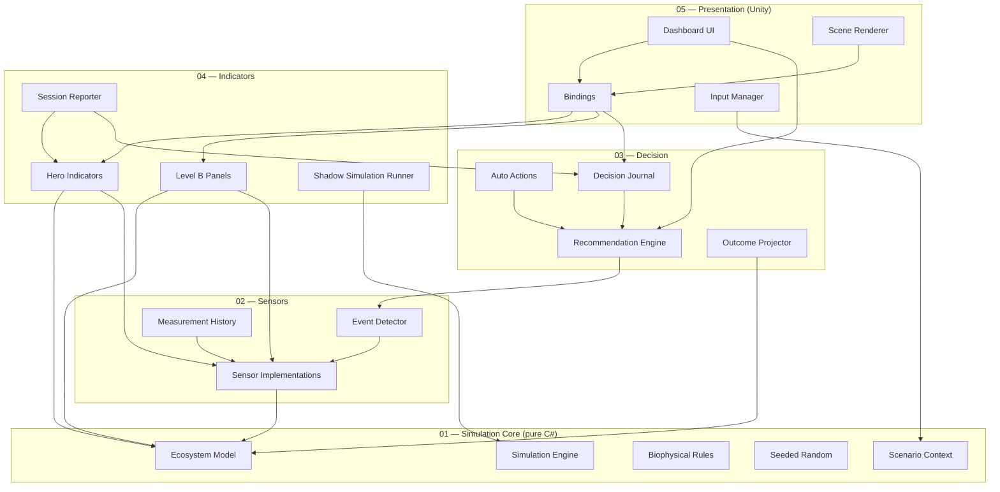

# ARCHITECTURE.md — Architecture technique

Document technique d'architecture du Bocage Digital Twin. À lire en
complément de `CLAUDE.md` (règles opérationnelles) et `DECISIONS.md`
(rationale des choix).

---

## 1. Schéma général en 5 couches



**Lecture** : une flèche `A --> B` signifie « A référence / dépend de B ».
Les flèches descendent toujours vers une couche d'indice strictement
inférieur. Aucune flèche ne remonte.

---

## 2. Description par couche

### Couche 01 — SimulationCore

**Responsabilité**

Modélisation biophysique pure du bocage. Tient l'état complet de
l'écosystème simulé et applique les règles de dynamique à chaque tick.

**Composants principaux**

- `SimulationEngine` : orchestrateur de tick, gère le temps simulé et la
  séquence d'application des règles.
- `EcosystemModel` : conteneur d'état (haies, prairie, bosquet, mare,
  arbres têtards, faune agrégée, météo, nappe, sol, etc.).
- `BiophysicalRules` : règles de dynamique (croissance, dégradation,
  hydrologie, propagation pathogènes, etc.). Implémente `IRule`.
- `SeededRandom` : générateur d'aléa déterministe avec sous-seeds dérivés
  par hash.
- `ScenarioContext` : paramètres scénario en cours (climat, pression
  agricole, contraintes réglementaires, horizon).
- `TransitioningParameter<T>` : interpolation des paramètres de scénario
  sur 7-14 jours simulés.

**Non-responsabilités**

- Aucun accès Unity (`UnityEngine`, `UnityEditor` interdits).
- Aucun I/O fichier ou réseau.
- Aucun rendu, aucun affichage.
- Aucune dépendance vers les couches supérieures.

**Dépendances** : aucune, hormis BCL .NET Standard 2.1.

---

### Couche 02 — Sensors

**Responsabilité**

Transforme l'état du modèle en mesures bruitées (modèle de capteur
réaliste) et détecte les événements significatifs.

**Composants principaux**

- `ISensor` : interface commune.
- Implémentations dans `Implementations/` (station météo, piézomètre,
  capteur acoustique, piège photo, tour eddy covariance).
- `FaunaSensorReader` : synthèse Gaussienne combinant deux capteurs
  indépendants (acoustique + piège photo) avec σ ∝ 1/√fauna (théorie
  Poisson : abondances rares → estimations plus bruitées). Sous-flux
  RNG dédié `"fauna-sensors"` dérivé du seed maître pour la
  reproductibilité indépendante des autres sous-systèmes. Sa lecture
  alimente l'`EventDetector` pour l'alerte fauna.
- `EventDetector` : compare l'état du modèle (et la lecture mesurée
  fauna) à des seuils calibrés pour émettre des événements (sécheresse
  prolongée, anomalie acoustique). Cooldown par type pour éviter le
  spam.
- `Events/` : `IEvent` + classes d'événements concrets
  (`DroughtProlongedEvent`, `FaunaAcousticAnomalyEvent`).
- `EventLog` : append-only chronologique des événements émis.

**Non-responsabilités**

- Ne modifie jamais l'état du modèle.
- Ne prend aucune décision.
- Ne touche pas à l'UI.

**Dépendances** : Couche 01 uniquement.

---

### Couche 03 — Decision

**Responsabilité**

Génère des recommandations à partir des événements détectés, projette
des issues probables sous incertitude, journalise les décisions.

**Composants principaux**

- `RecommendationEngine` : produit des recommandations à partir des
  événements détectés et du contexte.
- `Recommendations/` : interface `IRecommendation` + classes concrètes
  (`PlantHedgesRecommendation` dormante en v1, `IrrigationAdviceRecommendation`,
  `ReduceInputsRecommendation`).
- `OutcomeProjector` : projette des distributions d'issues à 2 horizons
  (30 j et 365 j) sous forme de 3-points (worst / expected / best) — pas
  de Monte-Carlo, distributions calibrées en dur (cf `DECISIONS.md`).
- `RecommendationProvenance` : helper de formatage pur (pas de Unity)
  qui résout l'`IEvent` source d'une reco depuis l'`EventLog` et
  renvoie une ligne « Détecté jour N par <capteur> — <event summary> »
  consommée par le popup décision et la liste historique (sub-étape 10a).
- `AutoActionPipeline` : applique l'effet mécanique de chaque reco
  Accepted / AutoAccepted sur l'`EcosystemModel` du run réel. Idempotent
  via `DecisionJournal.MarkApplied/IsApplied`. La triche `ReduceInputs`
  qui modifie directement le modèle au lieu du scénario partagé est
  formalisée dans ADR #43.
- `DecisionJournal` : journal append-only des décisions (utilisateur ou
  algorithmiques) avec horodatage simulé. Verdicts : `Pending`,
  `Accepted`, `Rejected`, `AutoAccepted`, et `Superseded` (auto-marqué
  quand un nouveau Pending de même type arrive — au plus 1 Pending par
  type à un instant donné, cf ADR #44).
- `DecisionVerdict` : enum des verdicts ci-dessus.

**Non-responsabilités**

- Ne lit pas l'UI directement (l'UI consomme les recommandations via
  observable).
- Ne mute jamais directement l'`EcosystemModel` ; les actions
  s'appliquent via une interface dédiée (`IModelAction`).

**Dépendances** : Couches 01 et 02.

---

### Couche 04 — Indicators

**Responsabilité**

Agrège l'état du modèle et les mesures en KPIs et panneaux. Pilote la
simulation fantôme. Produit le rapport de session.

**Composants principaux**

- `HeroIndicators` : 5 KPIs principaux (densité haies, biodiversité
  composite, nappe phréatique, rentabilité intégrée, delta tech).
- `LevelBPanels` : 3 panneaux (Biodiversité, Climat & ressources,
  Économie) agrégeant les sous-indicateurs.
- `ShadowSimulationRunner` : exécute une seconde instance de
  `SimulationEngine` avec mêmes seeds et inputs mais
  `applyTechActions = false`. Produit les valeurs nécessaires au calcul
  du delta.
- `SessionReporter` : génère un rapport de fin de session (résumé KPIs
  finaux, décisions journalisées, divergence shadow).

**Non-responsabilités**

- Ne mute jamais le modèle.
- Ne décide pas (consomme les sorties de la Couche 03).

**Dépendances** : Couches 01, 02 et 03.

---

### Couche 05 — Presentation

**Responsabilité**

MonoBehaviours Unity. Rendu de la scène, UI, bindings vers les
ScriptableObjects observables, gestion des inputs utilisateur.

**Composants principaux**

- `DashboardUI` : Hero KPIs, panneaux Niveau B, popovers Niveau C,
  scenario panel, decision panel, comparison view, minimap.
- `SceneRenderer` : organisation des sprites de scène (background,
  midground, foreground, fauna, sensors), shaders pilotés par
  observables.
- `Bindings` : MonoBehaviours qui écoutent les ScriptableObjects
  observables (`OnChanged`) et mettent à jour les éléments visuels et UI.
- `InputManager` : capture les inputs utilisateur (sliders, clics
  recommandation, vitesses temps) et les répercute dans le
  `ScenarioContext` ou le `RecommendationEngine`.

**Non-responsabilités**

- Ne contient aucune logique biophysique.
- Ne calcule aucun KPI directement.
- Ne mute pas l'état du modèle de simulation.

**Dépendances** : toutes les couches inférieures.

---

## 3. Flux principal de données

À chaque tick :

1. **Inputs utilisateur** captés par `InputManager` → mis à jour dans le
   `ScenarioContext` (avec interpolation via `TransitioningParameter<T>`).
2. **Tick de simulation** : `SimulationEngine.Tick()` applique les règles
   biophysiques sur l'`EcosystemModel`, en utilisant `SeededRandom` et
   le `ScenarioContext`.
3. **Lecture capteurs** : chaque `ISensor` lit l'état du modèle et
   produit une mesure bruitée. `EventDetector` examine les mesures et
   peut publier des événements sur l'`EventBus`.
4. **Décision** : `RecommendationEngine` consomme les événements détectés
   et produit / met à jour les recommandations. `AutoActions` applique
   les contre-mesures automatiques si `applyTechActions = true`.
5. **Indicateurs** : `HeroIndicators` et `LevelBPanels` recalculent les
   KPIs à partir de l'état + mesures. `ShadowSimulationRunner` fait
   tourner sa propre instance et expose les mêmes KPIs en parallèle. Le
   delta est calculé.
6. **Bindings** : les composants `Bindings` écrivent les valeurs dans
   les ScriptableObjects observables, qui notifient leurs abonnés via
   `OnChanged`.
7. **UI et Scene** : les abonnés (UI widgets, shaders pilotés) lisent
   les nouvelles valeurs et se rafraîchissent.

Ce flux est descendant à l'aller (input → modèle → indicateurs) et
remontant au retour (observables → UI). À aucun moment une couche
inférieure ne lit une couche supérieure.

---

## 4. Cycle de vie d'une session utilisateur

1. **Bootstrap** : chargement de la scène `Main`. `_Bootstrap` initialise
   le `SimulationEngine` (real run + shadow run avec mêmes seeds), les
   `ScenarioContext`, les ScriptableObjects observables, les bindings.
2. **État initial affiché** : KPIs initiaux, scène statique avec sprites
   en place, recommandations vides, journal vide.
3. **Lecture utilisateur** : l'utilisateur observe l'état initial,
   éventuellement règle un preset via le scenario panel.
4. **Lancement de la simulation** : utilisateur appuie play. Tick rate
   x1 par défaut.
5. **Boucle de simulation** : tick après tick, les KPIs évoluent, des
   événements peuvent être détectés et apparaissent dans le decision
   panel sous forme de recommandations.
6. **Arbitrage utilisateur** : l'utilisateur accepte ou rejette les
   recommandations. Les choix sont journalisés.
7. **Modification de scénario en cours** : changement de preset →
   transition interpolée 7-14 jours simulés.
8. **Skip to end** : l'utilisateur peut sauter à l'horizon configuré.
9. **Rapport de fin de session** : `SessionReporter` produit le rapport
   final (KPIs, divergence shadow, journal des décisions).
10. **Persistance** : `PlayerPrefs` sauvegarde uniquement la dernière
    configuration de presets et la vitesse choisie.

---

## 5. Modèle d'horloges

Trois horloges distinctes :

- **Temps réel** (`Time.unscaledDeltaTime` Unity) : utilisé uniquement
  pour les animations cosmétiques de la Couche 5 (interpolations
  visuelles, transitions UI).
- **Temps simulé** : avance d'un tick = un jour simulé. Cadencé par le
  `SimulationEngine` via une coroutine indépendante de `Time.timeScale`.
- **Vitesse utilisateur** : x1 (1 tick / seconde temps réel), x10 (10
  ticks / seconde), skip to end (boucle exécutée au plus vite jusqu'à
  l'horizon).

Comportement sur **pause** : le temps simulé est gelé, les animations
Couche 5 continuent à s'exécuter (les sprites de faune en pool restent
animés visuellement). C'est un choix délibéré pour éviter une scène
figée disgracieuse.

Le **skip to end** désactive temporairement les bindings vers la Couche
5 (pas de rafraîchissement intermédiaire de l'UI), exécute les ticks au
plus vite, puis pousse une mise à jour finale.

---

## 6. Gestion de la simulation fantôme

Interface centrale :

```csharp
public interface ISimulationRun
{
    EcosystemModel Model { get; }
    bool ApplyTechActions { get; }
    void Tick();
}
```

Deux instances sont créées au bootstrap :

- **Real run** : `applyTechActions = true`. Les recommandations
  acceptées et les `AutoActions` mutent le modèle.
- **Shadow run** : `applyTechActions = false`. Aucune action tech n'est
  appliquée. Reçoit les mêmes inputs scénario.

**Garanties** :

- Mêmes `SeededRandom` (seed maître identique, dérivation par hash
  identique pour les sous-systèmes).
- Mêmes `ScenarioContext` (les inputs utilisateur de scénario
  s'appliquent à both).
- Toute divergence d'état entre real et shadow est attribuable
  exclusivement à l'application (ou non) des actions tech.

Le `delta tech` Hero KPI = (KPI integrated profitability real) − (KPI
integrated profitability shadow), exprimé en pourcentage relatif à
shadow.

---

## 7. Conventions de nommage et d'organisation

### Classes

- `PascalCase` pour les noms de classes, types et méthodes publiques.
- `_camelCase` pour les champs privés.
- Suffixes explicites :
  - `*ScriptableObject` n'est pas nécessaire (le type est implicite par
    le namespace `Data.RuntimeContainers`).
  - `*Event` pour les classes d'événements de l'`EventBus`.
  - `*Binding` pour les MonoBehaviours de la Couche 5 qui écoutent un
    observable.
  - `*Rule` pour les règles biophysiques de la Couche 1.
  - `*Sensor` pour les implémentations de capteurs.

### ScriptableObjects observables

- Nom de fichier asset : `RC_<Domain>.asset` (ex.
  `RC_HedgerowDensity.asset`, `RC_Biodiversity.asset`).
- Stockés dans `Assets/_Project/Data/RuntimeContainers/`.
- Pattern : champ privé sérialisé + getter public + méthode `Set(value)`
  qui invoque `OnChanged`.

### Événements EventBus

- Classes immutables, suffixe `Event` (ex. `DroughtProlongedEvent`,
  `FaunaAcousticAnomalyEvent`).
- Stockés dans `Assets/_Project/Events/`.

### Asmdef

- Un asmdef par couche, nommé `Bocage.<Layer>` (ex.
  `Bocage.SimulationCore`, `Bocage.Sensors`, etc.).
- Références strictes définies dans le fichier asmdef.

### Scènes et hiérarchie

- Scène unique : `Main.unity` dans `Assets/_Project/`.
- 7 racines préfixées `_` (cf `CLAUDE.md` §8).

### Logging

- Pas de `Debug.Log` direct. Utiliser `SimLogger.DebugLog`,
  `SimLogger.SimulationLog`, `SimLogger.UserActionLog`.
- Format : `[<Layer>] <message> {context: ...}`.

### Tests

- Stockés dans `Assets/_Project/Tests/EditMode/`.
- Asmdef de tests référence uniquement la Couche 1 (les tests EditMode
  ne touchent pas Unity runtime).
- Nommage : `<ClassUnderTest>Tests.cs`.

---

## 8. Classes prévues post-recadrage 2026-05-28 (chantiers E1-E7)

Cette section liste les nouvelles classes et assets attendus par
chantier `ROADMAP.md`. Annotations only — ne pas implémenter sans
suivre le chantier correspondant.

### 8.1 Chantier E1 — Cleanup chalara + refactor actions manuelles (livré 2026-05-29)

**Couche 03 — Decision** :

- `SimulationRunner.ApplyManualXxx()` route les clics utilisateurs via
  les factories statiques `PlantHedgesRecommendation.Manual(day, seq, magnitude)`,
  `IrrigationAdviceRecommendation.Manual(...)`, `ReduceInputsRecommendation.Manual(...)`
  — pas de classes Manual* distinctes, les voies auto et manuelle
  partagent la même classe avec wordings différents.
- Convention `Id` : `manual-<action>#<day>-<sequence>` (compteur monotone
  par type dans `SimulationRunner` pour disambiguer les clics multiples
  le même jour).
- `RecommendationProvenance.Format()` étendu : fallback « Action
  déclenchée par l'utilisateur le jour X » si
  `TriggeredByEventId == null`.
- Pattern rationale uniforme ADR #55 implémenté via
  `FormatAutoRationale` / `FormatManualRationale` sur chaque rec.

**Couche 02 — Sensors** :

- `HedgeChalaraEvent.cs` supprimé (ADR #46).

**Couche 04 — Indicators** :

- Branche `ChalaraPenalty` retirée de `HedgerowHealthIndicator.Compute()`.

### 8.2 Chantier E2 — Saisonnalité + WeatherStation

**Couche 01 — Simulation Core** :

- `SeasonalWeatherDataAsset.cs` : ScriptableObject `[CreateAssetMenu]`
  avec 12 valeurs `MonthlyMeanTemperatureCelsius`, 12 valeurs
  `MonthlyPrecipitationMm`, 12 paramètres Markov
  `MonthlyRainParameters` (p_wet, mu, sigma).
- `MarkovRainModel.cs` : `class MarkovRainModel { float SampleDailyRain(int month, SeededRandom rng); }`.
- Refonte `WeatherUpdateRule` : signature inchangée, mais consomme
  `SeasonalWeatherDataAsset` (référence injectée via le runtime),
  applique Bernoulli(p_wet) puis LogNormal(mu, sigma) si pluvieux,
  ajoute bruit gaussien sur T° avec sous-flux `"weather-noise"`.
- Extension `CropYieldDynamicsRule` et `InputCostDynamicsRule` :
  terme dépendant de `CurrentWeather` réel (canicule directe →
  effet économique).

**Couche 02 — Sensors** :

- `WeatherStationReader.cs` : `class WeatherStationReader : ISensor`
  qui mesure `CurrentWeather` avec bruit gaussien. Pas d'événement,
  pas de reco.
- Interface `ISensorHistory<T>` (mutualisée avec E3 et E6) :
  sliding window 365 jours, `void Append(T sample); IReadOnlyList<T> Last365Days { get; }`.

**Couche 05 — Presentation** :

- `MonthSelectorBinding.cs` : widget combo Jan-Déc dans section
  « Conditions initiales ». Reset only at `CurrentDay == 0`.

### 8.3 Chantier E3 — Carbone sol + EddyTower

**Couche 01 — Simulation Core** :

- `SoilCarbonStock` (float, tC/ha) ajouté à `EcosystemModel`, default
  50.
- `SoilCarbonDynamicsRule.cs` : `class SoilCarbonDynamicsRule : IRule`
  qui applique `dC/dt = inputs − k·C` avec `k = 1/40 an⁻¹`.
- `CoverCropsCoveragePercent`, `ResidueRestitutionPercent` ajoutés à
  `ScenarioContext` (float 0-100).

**Couche 02 — Sensors** :

- `EddyTowerSensorReader.cs` : `class EddyTowerSensorReader : ISensor`
  qui mesure flux net CO2/CH4 journalier avec bruit gaussien.
  Sous-flux RNG `"eddy-tower"`. Stocke sliding window 365 j via
  `ISensorHistory<float>`.

**Couche 04 — Indicators** :

- `SoilCarbonIndicator.cs` : lecture pure de `SoilCarbonStock`,
  normalisation pour Hero/onglet.
- `RC_SoilCarbonStock` (asset Data/RuntimeContainers).

**Couche 05 — Presentation** :

- 2 sliders « Couverts d'interculture » et « Restitution résidus »
  dans scenario panel UXML.

### 8.4 Chantier E4 — Faune visible 4 espèces

**Couche 05 — Presentation** :

- `FaunaSpeciesDefinition.cs` (ScriptableObject) : `Sprite[] frames`,
  `float appearanceThreshold`, `Vector2 spawnPosition`,
  `IdleMotionPattern motionPattern`.
- 4 assets `FaunaSpecies_<Heron|Owl|Harrier|Swallow>.asset` dans
  `Assets/_Project/Data/Fauna/`.
- `FaunaPlacementDefinition.cs` (SO racine listant les espèces).
- `FaunaPool.cs` : MonoBehaviour, pré-instancie `maxPoolSize` sprites
  par espèce au Awake. **Pas d'Instantiate runtime** (CLAUDE.md §6).
- `FaunaIdleMotion.cs` : composant par sprite pool member, animation
  frame-swap (cycle 3-4 frames). Lecture `Time.time` une fois par
  Update, math.Sin only.
- `FaunaPoolBinding.cs` : observe `RC_BiodiversityComposite` (et
  `RC_FaunaFactor*` après E5) → ratio actif/inactif par espèce.

### 8.5 Chantier E5 — Capital + horizon + biodiv 3 facteurs

**Couche 03 — Decision** :

- Champ `float InvestmentCost` (€/ha) sur `IRecommendation`.
- `ManualPlantHedgesRecommendation` calcule
  `InvestmentCost = densité × prix_au_m_linéaire`.
- `DecisionJournal.TotalInvestment` (somme cumulée des entrées
  appliquées).

**Couche 01 — Simulation Core** :

- Refonte `FaunaDynamicsRule` : 3 facteurs (habitat, eau, intrants)
  calculés explicitement, exposés en sortie.
- Effet faible canicule (T° quotidienne) et effet faible carbone sol
  (lecture `SoilCarbonStock`) intégrés.

**Couche 04 — Indicators** :

- `InvestmentHorizonIndicator.cs` : calcul années pour récupérer
  l'investissement basé sur `cumulProfitDelta(t) >= InvestmentCost`.
- `RC_FaunaFactorHabitat`, `RC_FaunaFactorWater`,
  `RC_FaunaFactorInputs` (Data/RuntimeContainers).
- `RC_TotalInvestment`, `RC_InvestmentHorizon`.
- Recalibration `BiodiversityCompositeIndicator` (pondérations
  sourcées Vigie-Nature / Hallmann 2017 / MNHN 2024).

### 8.6 Chantier E6 — Panneau inspection capteurs + 3 onglets Niveau B

**Couche 05 — Presentation** :

- `SensorClickHandler.cs` : `MonoBehaviour` portant `IPointerClickHandler`,
  publie un event `SensorClickedEventBus` (statique) quand un sprite
  capteur est cliqué.
- `SensorInspectorPanel.uxml` + `SensorInspectorPanel.uss` : panneau
  modal réutilisable.
- `SensorInspectorPanelBinding.cs` : reçoit `OnSensorClicked` →
  reconfigure le contenu selon le capteur cliqué (5 layouts dédiés).
- `SensorHistoryChart.cs` : composant graphe custom (héritant de
  `VisualElement`) avec `generateVisualContent` callback. Lit
  `ISensorHistory<T>`.
- `WeatherNormalsPanelBinding.cs` : sous-panneau du
  `SensorInspectorPanel` pour les normales mois courant/suivant
  (lecture `SeasonalWeatherDataAsset`).
- `OngletBiodivBinding.cs` : 5 lignes (indice composite + 3 facteurs
  + comptage espèces visibles).
- `OngletClimatBinding.cs` : 5 lignes (nappe + T° glissante + précip
  glissantes + stock C + flux net CO2).
- `OngletEconomieBinding.cs` : 7 lignes (rendement + intrants +
  entretien + PSE + PAC + investissement cumulé + horizon).

**Configuration scène** :

- `Physics2DRaycaster` ajouté sur la `MainCamera`.
- `Collider2D` ajouté sur chaque sprite capteur (5 capteurs).
- Unity EventSystem actif dans la scène (déjà en place pour UI Toolkit
  cliquable).

### 8.7 Chantier E7 — Polish + publication

Pas de nouvelle classe. Configuration build (Crunch DXT5
conditionnel), polish UI léger, README + GIF + screenshots,
tri docs public/privé, audit final, tag v1.0.

---

## 9. Récap impact architecture

Le scope MVP post-recadrage **ne casse aucune architecture
existante**. Les 5 couches restent strictement empilées, l'asmdef
boundaries respectées. Les nouvelles classes s'insèrent dans les
couches existantes selon leur rôle :

| Couche | Nouvelles classes | Nouveaux assets |
|---|---|---|
| 01 | `MarkovRainModel`, `SoilCarbonDynamicsRule`, refonte `WeatherUpdateRule` + `FaunaDynamicsRule` + extensions `CropYield` / `InputCost` | `SeasonalWeatherDataAsset` |
| 02 | `WeatherStationReader`, `EddyTowerSensorReader`, `ISensorHistory<T>` | — |
| 03 | `Manual<Action>Recommendation` × 3, refactor `SimulationRunner.ApplyManualXxx`, champ `InvestmentCost` | — |
| 04 | `SoilCarbonIndicator`, `InvestmentHorizonIndicator`, recalibration `BiodiversityCompositeIndicator` | `RC_SoilCarbonStock`, `RC_FaunaFactor{Habitat,Water,Inputs}`, `RC_TotalInvestment`, `RC_InvestmentHorizon` |
| 05 | `MonthSelectorBinding`, `FaunaSpeciesDefinition` × 4 + `FaunaPool` + `FaunaIdleMotion` + `FaunaPoolBinding`, `SensorClickHandler`, `SensorInspectorPanel*`, `SensorHistoryChart`, `WeatherNormalsPanelBinding`, `OngletBiodivBinding`, `OngletClimatBinding`, `OngletEconomieBinding` | `FaunaSpecies_*.asset` × 4, `FaunaPlacement_Default.asset`, UXML/USS `SensorInspectorPanel` |

Aucun retournement de dépendances. Le boundary Unity / pure C# est
respecté intégralement.
